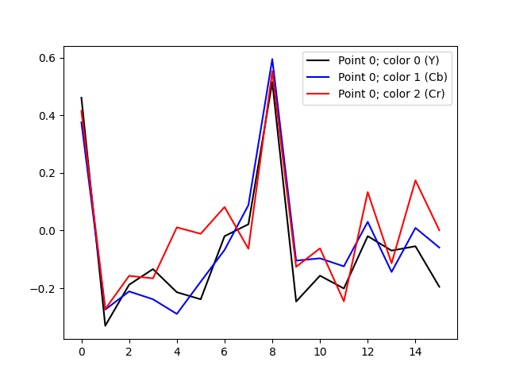
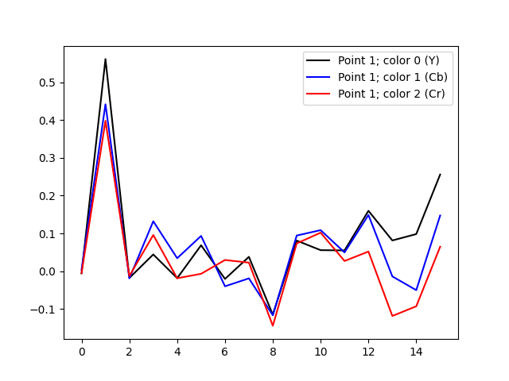
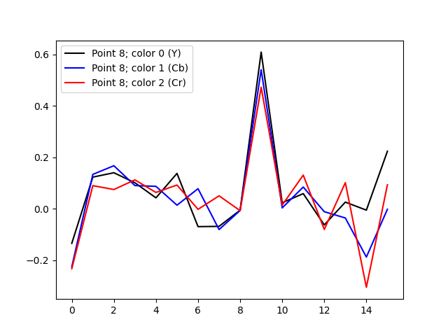
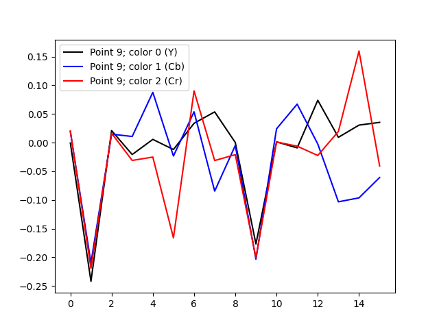

# JPG ACs analysis

The following images show [least-squares](https://en.wikipedia.org/wiki/Least_squares) solutions on the plots. 
There are 4 plots presenting 3 colors ([Y, Cb, Cr](https://en.wikipedia.org/wiki/YCbCr)) for AC values 0, 1, 8 and 9 respectively.
See [JPEG#Discrete_cosine_transform](https://en.wikipedia.org/wiki/JPEG#Discrete_cosine_transform) for more background.

The following input image from https://stocksnap.io/ has been used:

## AC0

## AC1

## AC8

## AC9

Kudos for [@krinfels](https://github.com/krinfels) for cooperation.
