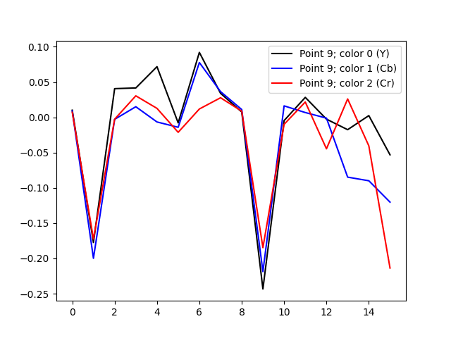

# JPG ACs analysis

The following images show [least-squares](https://en.wikipedia.org/wiki/Least_squares) solutions on the plots. 
There are 4 plots presenting 3 colors ([Y, Cb, Cr](https://en.wikipedia.org/wiki/YCbCr)) for AC values 0, 1, 8 and 9 respectively.
See [JPEG#Discrete_cosine_transform](https://en.wikipedia.org/wiki/JPEG#Discrete_cosine_transform) for more background.

The following input image from https://stocksnap.io/ has been used:

## Coefficient values coming from linear regression by AC 

The eight values from the corresponding row of left neighbor DC block
and the eight values from the corresponding column of upper neighbor DC block  
are the dataset for the linear regression.

 _ | 0 | 1
---|---|---
 0 |  | 
 1 |  | 

---

## COMPRESSION results 

See [COMPRESSION-RESULTS.md](COMPRESSION-RESULTS.md).

Kudos for [@krinfels](https://github.com/krinfels) for cooperation.

## Deps 

https://github.com/jurandy-almeida/jpeg
